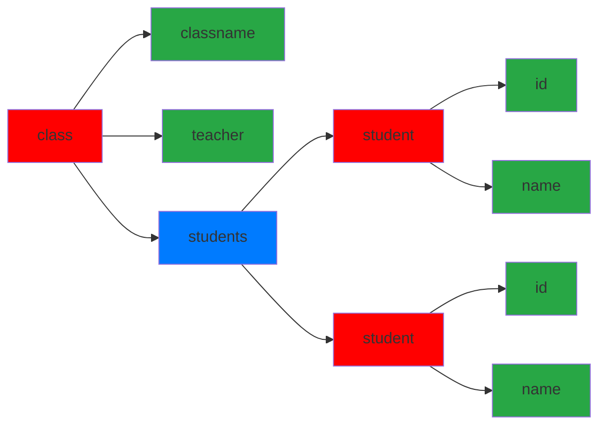

# **第六章 表單 (Form)**

## 兩種表單的差異

---

|  | 響應式 (Reactive Form) | 範本驅動 (Template-driven Form) |
| --- | --- | --- |
| 建立表單模型 | 明確的在Component建立FormControl | 隱含式，使用指令(Diretive)在Template之中 |
| 資料模型 | 結構化、不可變 | 非結構化、可變 |
| 資料流 | 同步 | 非同步 |
| 表單驗證 | 函式 | 指令 |

---

## 表單設計的選擇

---

- **Reactive Form**
    - 可擴展性
    - 可重用性
    - 可測試性
- **Template-driven Form**
    - 簡單容易
    - 擴展能力低

---

## 共同的基礎組件

---

- **FormControl**
    - 管理單一輸入項 (input、select) 的值及輸入驗證狀態
- **FormGroup**
    - 管理一組輸入項 (FormControl、FormGroup、FormArray) 的值及輸入驗證狀態
- **FormArray**
    - 管理輸入項陣列的值及輸入驗證狀態
- **FormBuilder**
    - 用來建立 FormCotrol 的方法



<span style="color:#FF0000" >紅色:FormGroup</span> |
<span style="color:#28a745">綠色:FormControl</span> |
<span style="color:#007bff">藍色:FormArray</span>  

---

## Reactive Form 的相關 Directive

---

- 用於將相對物件同步到DOM元素
    - FormControlDirective
    - FormControlName
    - FormGroupDirective
    - FormGroupName
    - FormArrayName

---

## 以 Reactivate Forms 製作簡單的表單

---

- App.modules.ts 需引用 ReactiveFormsModule

```ts title="App.modules.ts"
import { ReactiveFormsModule } from '@angular/forms';

@NgModule ({
 ...
 import: [
  BrowserModule,
  ReactiveFormsModule
 ],
 ...
})
```

---

- 定義 Model 作為表單資料來源

```ts title="meeting-Room.ts"
export class MeetingRoom {
  constructor(
   public id: number, 
  public name: string, 
  public size: string, 
  public projector?: boolean, 
  public TV?: boolean
  ) { }
}
```

- 使用 FormBuilder 建立 Form Controls

```ts title="page1.component.ts"
export class Page1Component {
  // 定義一個 capacity 陣列，包含不同的會議室容量選項。
  public capacity = ['5人', '10人', '20人', '30人', '40人'];
  
  // 宣告一個 FormGroup 類型的變數 meetingRoomForm，用於管理表單。
  public meetingRoomForm: FormGroup;
  
  // 宣告一個 MeetingRoom 類型的變數 meetingRoom，用於存儲會議室資訊。
  public meetingRoom: MeetingRoom;

  // 在構造函數中，使用 FormBuilder 來建立表單。
  constructor(public builder: FormBuilder) {
    // 創建一個新的 MeetingRoom 實例，並賦值給 meetingRoom 變數。
    this.meetingRoom = new MeetingRoom(101, '哥多華', this.capacity[2], false, true);
    
    // 使用 FormBuilder 的 group 方法來定義表單的結構和規則。
    this.meetingRoomForm = this.builder.group({
      'id': ['', [Validators.required]], // 表單控件 id，必填。
      'name': ['', [Validators.required]], // 表單控件 name，必填。
      'size': [''], // 表單控件 size，非必填。
      'projector': [''], // 表單控件 projector，非必填。
      'TV':[''] // 表單控件 TV，非必填。
    })
  }

  // 在組件初始化時，使用 setValue 方法將 meetingRoom 的資訊填充到表單中。
  ngOnInit(): void {
    this.meetingRoomForm.setValue(this.meetingRoom);
  }
  
  onSubmit() {
   // 將表單的值賦給 meetingRoom 變數。
   this.meetingRoom = this.meetingRoomForm.value;
 }
}
```

---

- Template 中設定 formCotrolName

```html title="page1.component.html"
<div class='container'>
  <h1>Meeting Room Form</h1>
  <form [formGroup]="meetingRoomForm" (ngSubmit)='onSubmit()'>
    <div class='form-group'>
      <label for="name">名稱</label>
      <input type="text" class='form-control' formControlName="name">
    </div>
    <div class='form-group'>
      <label for="size">容納人數</label>
      <select class='form-control' formControlName="size">
        <option *ngFor="let cap of capacity" [value]='cap'> {{ cap }} </option>
      </select>
    </div>
    <div class='container'>
      <div class='form-check form-check-inline'>
        <label for="projector" class='form-check-label'>投影機</label>
        <input type="checkbox" class='form-check-input' formControlName="projector">
      </div>
      <div class='form-check form-check-inline'>
        <label for="TV" class='form-check-label'>電視</label>
        <input type="checkbox" class='form-check-input' formControlName="TV">
      </div>
    </div>
    <button type='submit' class='btn btn-success'>Submit</button>
  </form>
</div>
```

---

- 觀察 meetingRoomForm.value 與 meetingRoom 的改變

```html
<div class='container'>
  <div>meetingRoomForm.value: {{ meetingRoomForm.value | json }}</div>
  <div>meetingRoom: {{ meetingRoom | json }} </div>
</div>
```

**`meetingRoomForm.value`** 會隨著用戶與表單的互動而實時更新，而 **`meetingRoom`** 的值則會在表單提交時更新，反映用戶提交的最終數據。

---

## 以Template-Driven 製作表單

---

- app.module 引入 FormsModule

```ts
import { FormsModule} from '@angular/forms';

@NgModule ({
 ...
 import: [
  BrowserModule,
  FormsModule
 ],
 ...
})
```

---

- 初始化 Model 的值

```ts title="page2.component.ts"
public meetingRoom: MeetingRoom;
public capacity = ['5人', '10人', '20人', '30人', '40人'];

constructor() {
    this.meetingRoom = new MeetingRoom(101,'哥多華',this.capacity[2],false,true);
}
```

---

- 使用 [(ngModel)] 及 name 指定

```html title="page2.component.html"
<div class='container' *ngIf="!submitted">
  <h1>會議室基本資料</h1>
  <form #roomForm='ngForm' (ngSubmit) = "onSubmit(roomForm)">
    <div class='form-group'>
      <label for="name">名稱</label>
      <input type="text" class='form-control' id='name' name='name'[(ngModel)]="meetingRoom.name">
    </div>
    <div class='form-group'>
      <label for="size">容納人數</label>
      <select class='form-control' name='size' [(ngModel)]="meetingRoom.size">
        <option *ngFor="let cap of capacity" [value]='cap'> {{ cap }} </option>
      </select>
    </div>
    <div class='form-group'>
      <div class='form-check form-check-inline'>
        <input type="checkbox" class='form-check-input' name="projector" [(ngModel)]="meetingRoom.projector">
        <label for="projector" class='form-check-label'>投影機</label>
      </div>
      <div class='form-check form-check-inline'>
        <input type="checkbox" class='form-check-input' name="TV" [(ngModel)]="meetingRoom.TV">
        <label for="TV" class='form-check-label'>電視</label></div>
    </div>
    <button type='submit' class='btn btn-success m-3'>Submit</button>
  </form>
</div>
```

---

- 傳遞ngForm
- 使用 #宣告變數 存入 ngForm 的值
  - ngForm 管理 提供表單 及 ngModel 項目 name 的屬性，使其能夠彼此參考

=== ".html"

    ```html
    <form #roomForm='ngForm' (ngSubmit) = "onSubmit(roomForm)">
    ```

=== ".ts"

    ```ts
    submitted: Boolean = false;

    onSubmit(roomForm: NgForm) {
    // 檢查傳入的表單是否有效。
        if (roomForm.valid)
        console.log(roomForm.value);

        this.submitted = true;
    }
    ```

認識 form 與 ngForm

- 繫結到表單 <form> </form>
- FormGroup 的最上層
- @OutPut
  - ngSubmit: 按下 submit 按鈕時的事件
- @Input
  - control: FormGroup 的實體
  - controls {[key:string]:AbstractControl}：控制項的對應

---

## novalidate / ngNativeValidate

---

- novalidate
  - 避免預設的 HTML5 DOM 的驗證 UI 呈現
  - <form> (FormModule 或 ReactiveFormModule) 預設的定義
  - 目的：讓開發者可以自訂輸入驗證的提醒
- ngNativeValidate
  - 開啟預設的 HTML5 DOM 的驗證UI呈現

    ```html
    <form ngNativeValidate>
    ...
    </form>
    ```

---

- 使用 ngNativeValidate

```html
<form #roomForm='ngForm' (ngSubmit) = "onSubmit(roomForm)" ngNativeValidate>
    <div class='form-group'>
      <label for="name">名稱</label>
      <input type="text" class='form-control' id='name' name='name'
        [(ngModel)]="meetingRoom.name" required>
    </div>
    ...略...
```


---

- 使用 novalidate

```html
<form #roomForm='ngForm' (ngSubmit) = "onSubmit(roomForm)">
    <div class='form-group'>
      <label for="name">名稱</label>
      <input type="text" class='form-control' id='name' name='name'
       [(ngModel)]="meetingRoom.name" required>
    </div>
    ...略...
```

---

## 實作驗證提醒

---

1. 去掉 ngNativeValidate
2. 了解 輸入過程 Angular 提供那些資訊
3. 利用這些訊息呈現驗證提醒

---

ngModel 追蹤輸入項目和驗證能力

- 是否輸入項目已經被進入過了？
  - Yes：ng-touched
  - No：ng-untouched
- 是否輸入項已經被變更了
  - Yes：ng-dirty
  - No：ng-pristine
- 是否輸入項已經驗證通過？
  - Yes：ng-valid
  - No：ng-invalid

---

如何取得ngModel 的驗證資訊

```html
<input type="text" class='form-control'[(ngModel)]="meetingRoom.name" required
 name="roomName" #roomName="ngModel">
```

- 使用 # 命名並指向 ngModel
- 必須搭被 [{ngModel}] 使用
- 該物件便具有 ng-teach、ng-dirty、ng-valid … 等 bool 屬性
- 可做為驗證輸入狀態的檢查

```html
<div *ngIf="roomName.invalid" class='alert alert-danger'>名字欄位不可空白</div>
```

---

## 查看 ngModel 添加的 className

---

- required

```html
<input type="text" class='form-control' id='name' name='name'
    [(ngModel)]="meetingRoom.name" required>
```

- 透過 style 設定 驗證的呈現效果
  - **`.ng-valid[required], .ng-valid.required`**：當一個必填的表單控件通過驗證時，它的左邊框會顯示為綠色。

    

  - **`.ng-dirty:not(form)`**：當表單控件的值被修改過（變得 “dirty”）且不是 **`<form>`** 元素時，它的邊框會顯示為藍色。

    

  - **`.ng-invalid:not(form)`**：當一個表單控件沒有通過驗證時，它的左邊框會顯示為紅色。

    

```html
<style>
  .ng-valid[required],
  .ng-valid.required {
    border-left: 5px solid #42A948;
    /* green */
  }
  .ng-dirty:not(form) {
    border: 1px solid blue;
  }
  .ng-invalid:not(form) {
    border-left: 5px solid #a94442;
    /* red */
  }
</style>
```

- 驗證錯誤時的提醒訊息

```html
<div class='form-group'>
      <label for="name">名稱</label>
      <input type="text" class='form-control' id='name' name='name'
         [(ngModel)]="meetingRoom.name" #roomName='ngModel' required>
      <div *ngIf="roomName.invalid" class='alert alert-danger'>名字欄位不可空白</div>
</div>
```


- 輸入驗證的視覺回饋

```ts
newMeetingRoom() {
  //設定新的會議室初始值
    this.meetingRoom = new MeetingRoom(102, ", ", this.capacity[1],false,true);
}
```

```html
<button type='button' class='btn btn-primary' 
    (click)=' roomForm.reset();newMeetingRoom();'>新增會議室</button>
```

- 提交表單按鈕
  - 在 form 元素加入 ngSubmit 指定 onSubmit 事件處理程序
  - 透過綁定 disabled 與 roomForm 變數參考表單是否通過驗證
  - 檢查輸入驗證是否通過決定是否允許按下 Submit 按鈕

```html
<form #roomForm='ngForm' (ngSubmit) = "onSubmit(roomForm)" >
 ...
 
 <!-- [disabled] 是否禁用 HTML 元素 -->
 <button type='submit' class='btn btn-success m-3' 
     [disabled]='roomForm.form.invalid'>Submit</button>
```

- 切換兩個表單的區域
  - submitted 變數切換內容

```html
<div class='container' *ngIf="!submitted">
  <h1>會議室基本資料</h1>
  ...略...
</div>

<div class='container' *ngIf="submitted">
  <h2>以下是你提交的資訊</h2>
  <div class='table'>
    <div class='row'>
      <div class='col-4'>名稱</div>
      <div class='col-6'> {{ meetingRoom.name }} </div>
    </div>
    <div class='row'>
      <div class='col-4'>容納人數</div>
      <div class='col-6'> {{ meetingRoom.size }} </div>
    </div>
    <div class='row'>
      <div class='col-4'>投影機</div>
      <div class='col-6'> {{ meetingRoom.projector }} </div>
    </div>
    <div class='row'>
      <div class='col-4'>電視</div>
      <div class='col-6'> {{ meetingRoom.TV }} </div>
    </div>
  </div>
  <div>
    <button class='btn btn-primary' (click)='submitted=false'>編修</button>
  </div>
</div>
```
